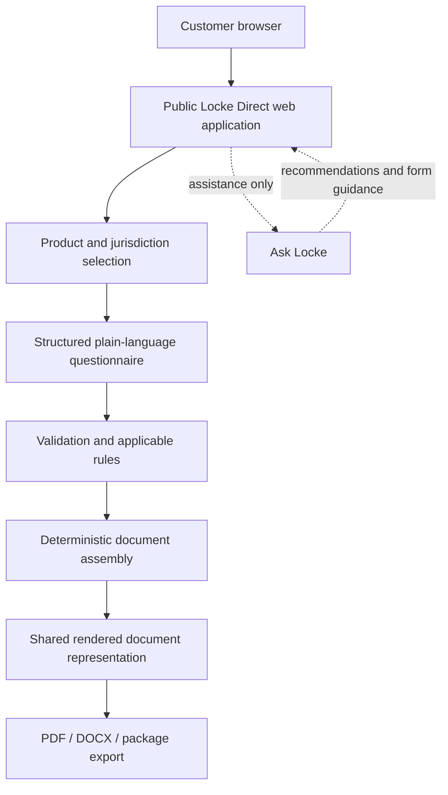

# Locke Direct

> Public technical reference for Locke Direct. This repository contains documentation, not application source code.

**Operator:** Locke Development LLC
**Official site:** <https://www.lockedirect.com>
**Repository type:** Public technical and operational reference
**Source code:** Not included
**Transparency snapshot refreshed:** 2026-08-26

## What Locke Direct is

Locke Direct is a consumer self-service legal-document preparation platform. A customer selects a document or package, selects a jurisdiction where the workflow requires it, completes a structured plain-language questionnaire, reviews the result, completes a one-time purchase, and receives supported deliverables such as PDF and DOCX. Available products also expose revision and first-party electronic-signing functions within their defined scope.

The final document is assembled from maintained document structures, clause content, questionnaire answers, and applicable jurisdiction data. The core legal-document assembly path is deterministic; it is not an unrestricted request for an AI model to invent a legal instrument from scratch.

## What Locke Direct is not

- Locke Direct is not a law firm and does not represent customers as legal counsel.
- It does not provide legal advice or guarantee that a document is valid or enforceable in a particular situation.
- Ask Locke is an assistance layer for document selection and form guidance, not the authoritative legal-document generator.
- This repository is not an open-source distribution of the product and contains no proprietary application source, templates, prompts, customer records, or credentials.

## Current production snapshot

The public documentation was refreshed on 2026-08-26 to reflect the current release line. Automated test figures below are retained as the most recent complete recorded verification run and are dated separately; they should not be read as a fresh test run against the later application revision.

| Item | Recorded state |
|---|---|
| Curated catalog | 118 products |
| Production availability | 118 released products represented in the public catalog snapshot |
| Price levels | $5.99, $29.99, $49.99, $99.99 |
| Revision entitlement | $5.99: 1 included revision; $29.99/$49.99/$99.99: unlimited revisions for 30 days after purchase |
| Latest complete application test record | 848/848 passed on 2026-08-20 |
| Latest complete focused security test record | 98/98 passed on 2026-08-20 |
| Latest complete document test record | 376/376 passed on 2026-08-20 |
| TypeScript typecheck | Passed in the 2026-08-20 verification record |
| Lint | Passed in the 2026-08-20 verification record |
| Launch preflight | Passed in the 2026-08-20 verification record |
| Production build | Passed in the recorded 2026-08-20 release verification sequence |
| Dependency audit | `npm audit --omit=dev`: 0; full `npm audit`: 0 on 2026-08-20 |
| Hosting | Railway |
| Payment processor | Stripe |
| Search indexing | Enabled for the production site |
| Current release-line revision | `0d27e70` |
| Previous fully verified release revision | `e09c077` |

The four price-level counts are 21 products at $5.99, 63 at $29.99, 18 at $49.99, and 16 at $99.99. Product count and document count are different: some products deliver multi-document packages.

The post-August-20 release line added a standalone **Living Will / Health Care Declaration** at the $29.99 level. The release also added pinned official/statutory living-will implementations for Connecticut, Illinois, Arizona, Florida, and California.

## High-level architecture

## Documentation index

- [System overview](SYSTEM-OVERVIEW.md)
- [Document assembly](DOCUMENT-ASSEMBLY.md)
- [AI boundaries](AI-BOUNDARIES.md)
- [Security architecture](SECURITY-ARCHITECTURE.md)
- [Privacy and data handling](PRIVACY-AND-DATA-HANDLING.md)
- [Payments and entitlements](PAYMENTS-AND-ENTITLEMENTS.md)
- [Jurisdiction model](JURISDICTION-MODEL.md)
- [Testing and quality](TESTING-AND-QUALITY.md)
- [Product catalog](PRODUCT-CATALOG.md)
- [Limitations](LIMITATIONS.md)
- [Release verification](RELEASE-VERIFICATION.md)
- [Facts](FACTS.md)
- [Responsible disclosure](RESPONSIBLE-DISCLOSURE.md)
- [Architecture diagrams](architecture/README.md)
- [Verification records](verification/README.md)
- [Changelog](CHANGELOG.md)

## Independent verification resources

- [Official Locke Direct site](https://www.lockedirect.com)
- [Public product catalog](https://www.lockedirect.com/agreements)
- [Privacy policy](https://www.lockedirect.com/privacy)
- [Terms](https://www.lockedirect.com/terms)
- [Refund policy](https://www.lockedirect.com/refund-policy)
- [This repository's commit history](https://github.com/Amishgangsta/Locke-Direct-Transparency/commits/main)

The production implementation is maintained in a separate private repository. Implementation-derived statements in this repository are identified as maintainer-verified rather than independently audited. Publicly observable evidence includes the official site, public policies, catalog, this repository, and its commit history.

## Corrections

If information in this repository appears inaccurate, incomplete, or outdated, open a GitHub issue with the relevant source or observation. Do not put credentials, customer information, exploitable security details, or proof-of-concept attacks in a public issue. Verified corrections will be incorporated into the documentation history.
