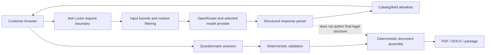

# AI Boundary

**Last verified:** 2026-08-20

The separated arrows are the principal product boundary: AI guidance can help a customer navigate a product or field, while maintained structures and deterministic assembly control the final document.
