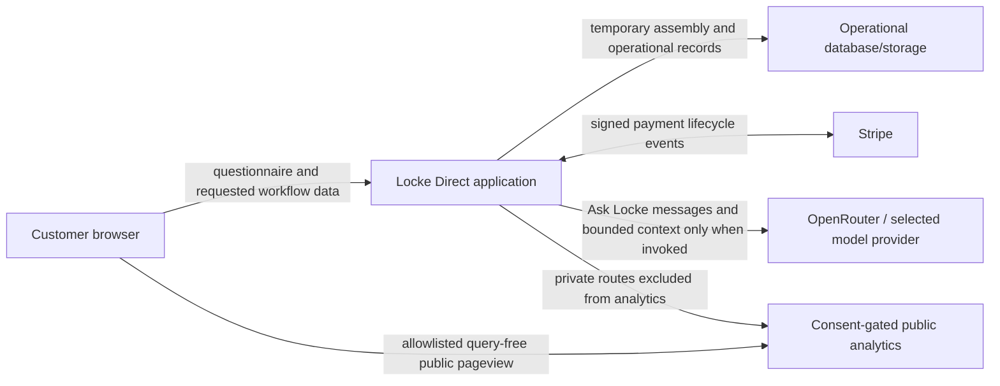

# Data Boundary

**Last verified:** 2026-08-20

This diagram describes data categories and trust boundaries, not a complete network topology. It intentionally omits private hostnames, credentials, internal endpoints, and storage identifiers.
