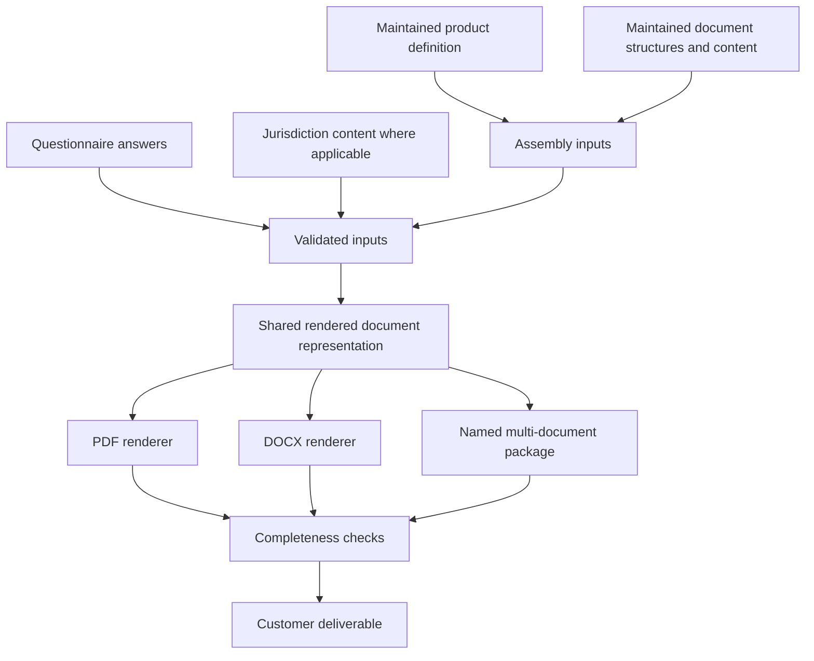

# Document Flow

**Last verified:** 2026-08-20

The model is intentionally conceptual. The public repository does not publish proprietary templates, clause text, questionnaire schemas, or source code.
