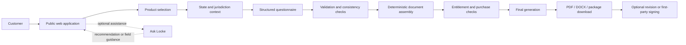

# System Flow

**Last verified:** 2026-08-20

```mermaid
flowchart LR
  C[Customer] --> W[Public web application]
  W --> S[Product selection]
  S --> J[State and jurisdiction context]
  J --> Q[Structured questionnaire]
  Q --> V[Validation and consistency checks]
  V --> A[Deterministic document assembly]
  A --> T[Entitlement and purchase checks]
  T --> G[Final generation]
  G --> D[PDF / DOCX / package download]
  D --> R[Optional revision or first-party signing]
  W -. optional assistance .-> L[Ask Locke]
  L -. recommendation or field guidance .-> W
```

Ask Locke is shown as a side path. It does not replace the validation, entitlement, or deterministic assembly path.
